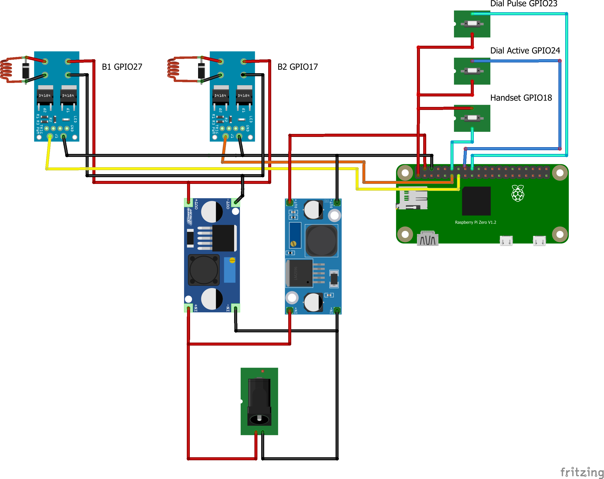
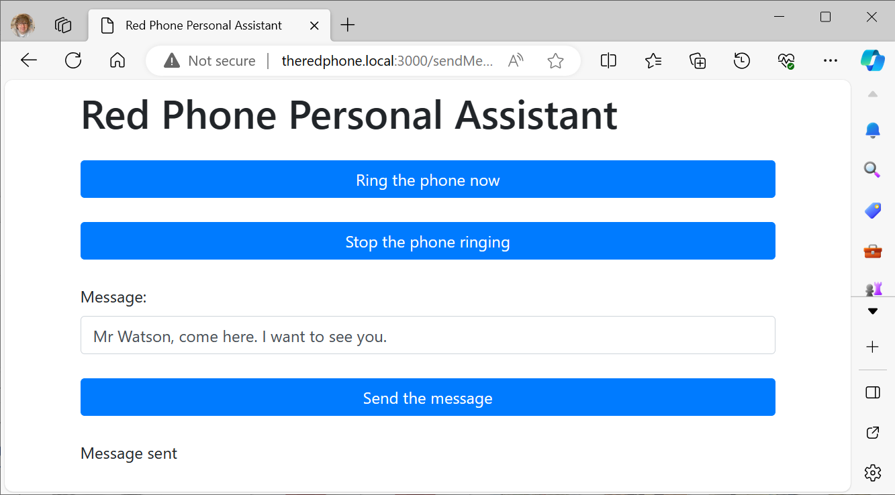

# Raspberry Pi 


Make an old-style dial telephone into something a bit more interesting.

[](https://youtu.be/aNzIdzsJkjI)

To find out more about the device click on the image above to see a short video.

## Building the device
The parts you'll need are as follows:

* An old-style telephone with a dial. The author used a 746 model he picked up in a second-hand shop. 

* I think the phone should be red, like the original “batphone” but the software will work with other colours.
* A Raspberry Pi Zero 2. Any colour you like.
* Two power switches for the bell. The author used a design which had dual D4184 MOSFETs. This can be driven directly by the GPIO signals from the Raspberry Pi.
* A power supply to convert 12 volts to 35 volts for the bell.
* A power supply to convert 12 volts to 5 volts for the Raspberry Pi.
* A 12-volt power supply for the above. 
* A Raspberry Pi GPIO breakout board to mount all the components. 
* A USB audio adapter and micro-USB “on the go” cable to connect it.



The Raspberry Pi GPIO pins are shown on the circuit diagram. There is also a USB sound interface plugged into the Raspberry Pi "On the Go" usb socket via a suitable adapter. 
## Packaging the components

There is a 3D printable design for the Raspberry Pi holder in the holder folder.

This is the built system.
## Setting up the Raspberry Pi
Steps to install software:
### Make an sd card for your Pi
1. Start the Raspberry Imager program on your machine and put the microSD card into the drive on your computer. 
1. Select the OS to be installed. Make sure you are not installing a desktop. You will be using your Raspberry Pi without a screen, keyboard or mouse. (I used Debian Bullseye Light)
1. Set the advanced options in the Imager program. Now make the folling settings. 
    1. Hostname (I called mine "theredphone")
    1. Enable SSH (password authentication)
    1. User: xxxx Password: xxxxxx (don't use x, put in your own words) I created a user called rob (it's used in the ssh command a few steps down)
    1. Set Wi-Fi credentials and locale
    1. Save the options so you can use them again if you need to
1. Make the image.
### Configure your Pi
1. Remove the SD card from your computer, plug it into your Raspberry Pi and turn the Pi on. Wait a few minutes until the green led on the Pi seems to settle down a bit.
1.	Now log in from your computer. You'll need a command prompt to do this. The commands given are from Microsoft PowerShell. You will be setting up a secure shell, so use the command ssh:
    ```
    ssh theredphone.local -l rob
    ```
1.	Use the name of the computer and the username that you set in the steps above. Say yes to set up the connection if it is the first time you've connected.
1.	Give your password when it is requested.
1.  Once you've logged in you should update your computer:
    ```
    sudo apt update
    ```
1.	Now set up SSL to allow your remote machine to connect to the PI.
    1. On the Pi
        1. Check for existing SSH
            ```
            ls ~/.ssh
            ```
        1. If this comes back with some files they are already there. Otherwise:
            ```
            ssh-keygen
            ```

        1.	Use the defaults
    1.	On your remote machine
        1.	Copy your keys over:
            ```
            cat ~/.ssh/id_rsa.pub | ssh rob@theredphone.local 'mkdir -p ~/.ssh && cat >> ~/.ssh/authorized_keys'
            ```

        1. I used the username and the address of the pi I’m setting up. Enter the password for the user (in my case rob)
    1. Now you can test the connection. Open another terminal window on your remote machine and connect directly to the pi with no password:
        ```
        ssh theredphone.local -l rob
        ```
    1. This should open a remote terminal session with no password required. If this works you will be able to use remote development with Visual Studio Code.
### Install git
1. Now we need to install git on your machine:
    ```
    sudo apt-get install git -y
    ```
1. Next we need to configure the username and email values for the Git installation on the machine. Use your email and username as appropriate. 
    ```
    git config --global user.name "Rob Miles"
    git config --global user.email rob@robmiles.com
    ```
### Install node 

1.	Now install nodejs and npm:
    ```
    sudo apt install nodejs
    sudo apt install npm
    ```
### Install audio output and speech
1.  Install the audio headers for the espeak:
    ```
    sudo apt-get install libasound2-dev
    ```
1.	Now install espeak:
    ```
    sudo apt-get install espeak
    ```
1.	Now set up the audio playback. This is going to make the USB sound adapter the default audio device. If you try to run the server without the audio interface plugged in the phone software will fail:
    ```
    sudo nano /usr/share/alsa/alsa.conf
    ```
    1.  Find:
        ```
        defaults.ctl.card 0
        defaults.pcm.card 0
        ```
    1.	Change to: 
        ```
        defaults.ctl.card 1
        defaults.pcm.card 1
        ```
    1. reboot the machine
        ```
        sudo reboot
        ```
### Start developing with Visual Studio Code
Will be developing the code on our PC or laptop. The version of Visual Studio Code on that device will communicate with remote connection software running on the Raspberry Pi. 
1.	Open Visual Studio Code on your PC or laptop. 
1.	Make sure to turn off things that slow us down. 
    1. Select the Extensions tab and enter the following into the extensions search window:
        ```
        @builtin typescript
        ```
    1. Two plugins should be found. Click the gear icon and select "Disable Workspace" from the menu for each. You will lose a few useful features when editing the code, but at least the Raspberry Pi won't freeze up.
1. Ensure you have Remote Development installed on your machine. If you don't, open extensions and install it. If it is installed you will have a green icon in the bottom left of your Visual Studio Window. Click this to open a remote development window.
1.  Select "Connect to Host - Remote SSH" from the menu which appears. The first time you make the connection you will be asked to enter the username and address of your machine. I used rob@redphone.local - you use the one you set. 
1. Create a new remote connection (rob@theredphone.local)
1.	Now clone the repository.
    1. Select "Clone a repository" from the start page of Visual Studio Code and open the following repository:
    ```
    https://github.com/CrazyRobMiles/RaspberryPi-DialTelephone
    ```
1. Now we need to install all the libraries in the project (we only need to do this once)
    ```
    npm install
    ```
1. Now open a terminal window and start the server:
    ```
    node redserver.js
    ```
The server should start up and you can interact with the phone. 

If you want to make the server run automatically when the Raspberry Pi starts you can do this by editing the rc.local file. 
# Adding sound input
You can make your phone even more interesting by adding audio input. You can use this to record messages or, by using speech to text, understand voice commands. 
## Sound input circuit

You can add voice input to the phone by building a small circuit and connecting it to the carbon microphone in the telephone handset. The sound quality is not as good as a modern microphone, but it does work with speech recognition and it has the "authentic telephone" sound.


The circuit above alows the phone handset microphone to be connected to a standard microphone input such as the one fitted to USB audio converter you might use with a Raspberry Pi. 
## Recording audio
The application uses the mic application to record audio. It is called from within the helper function /helpers/soundInput.js.

## Speech to text software
The updated phone software uses the Spchcat program you can find [here](https://github.com/petewarden/spchcat) The program runs on a Raspberry Pi Zero but it takes a few seconds to complete a conversion. 

Follow the instructions on the repository to install the software. It is called from within the phone software by the helper function in /helpers/speechInput.js. 


Have fun

Rob Miles